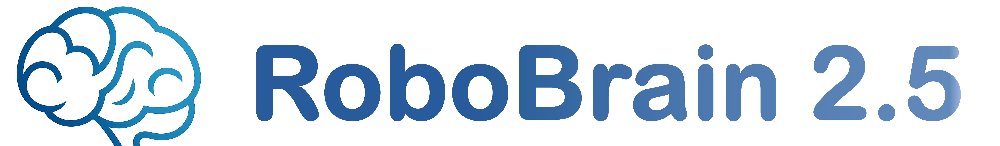
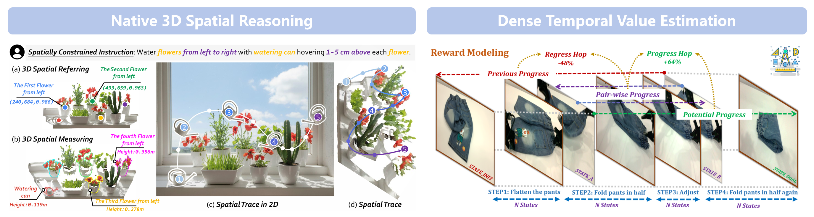
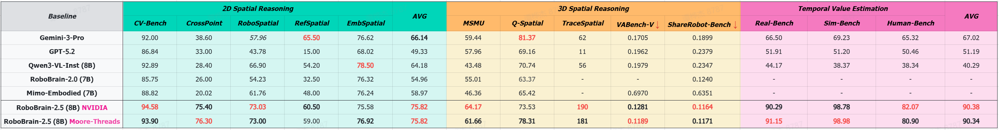

<div align="center">

</div>

<h1 align="center">RoboBrain 2.5: Depth in Sight, Time in Mind. </h1>

<p align="center">
        </a>&nbsp&nbsp⭐️ <a href="https://superrobobrain.github.io/">Project Page</a></a>&nbsp&nbsp | &nbsp&nbsp🤗 <a href="https://huggingface.co/collections/BAAI/robobrain25/">Hugging Face</a>&nbsp&nbsp | &nbsp&nbsp🤖 <a href="https://www.modelscope.cn/models/BAAI/RoboBrain2.5-8B-NV">ModelScope</a>&nbsp&nbsp 

</p>
<p align="center">
        </a>&nbsp&nbsp📑 <a href="https://arxiv.org/abs/2601.14352">2.5 Technical Report</a>&nbsp&nbsp | &nbsp&nbsp📑 <a href="https://arxiv.org/abs/2507.02029"> 2.0 Technical Report</a>&nbsp&nbsp | &nbsp&nbsp💬 <a href="./assets/wechat.png">WeChat & RedNote</a>
</p>

</p>
<p align="center">
        </a>&nbsp&nbsp🔥 <a href="https://robo-dopamine.github.io/">Robo-Dopamine</a>: Research on Dense Temporal Value Estimation Capability for <strong>RoboBrain 2.5</strong>.
</p>
<p align="center">
        </a>&nbsp&nbsp🔥 <a href="https://zhoues.github.io/RoboTracer/">RoboTracer</a>: Research on Native 3D Spatial Reasoning Capability for <strong>RoboBrain 2.5</strong>.
</p>
<p align="center">
        </a>&nbsp&nbsp🎯 <a href="https://flagopen.github.io/RoboOS/">RoboOS</a>: An Efficient Open-Source Multi-Robot Coordination System for RoboBrain 2.0.
</p>
<p align="center">
</a>&nbsp&nbsp⭐️ <a href="https://github.com/tanhuajie/Reason-RFT">Reason-RFT</a>: Core Post-Training Strategy for Embodied Visual Reasoning in RoboBrain 2.0.
</p>
<p align="center">
</a>&nbsp&nbsp🌍 <a href="https://superrobobrain.github.io/robobrainv2/index.html">RoboBrain 2.0</a>: 2.0 version of RoboBrain. See Better. Think Harder. Do Smarter.
</p>
<p align="center">
</a>&nbsp&nbsp🌍 <a href="https://github.com/FlagOpen/RoboBrain">RoboBrain 1.0</a>: A Unified Brain Model for Robotic Manipulation from Abstract to Concrete.
</p>

💬 ***If you have any questions, feel free to contact us via WeChat or RedNote.***
<div align="center">

</div>

## 🔥 Overview
**RoboBrain-2.5** is a next-generation Embodied AI foundation model that significantly evolves its predecessor's core capabilities in general perception, spatial reasoning, and temporal modeling through extensive training on high-quality spatiotemporal data. It achieves a paradigm shift in 3D Spatial Reasoning, transitioning from 2D relative points to predicting 3D coordinates with depth information, understanding absolute metric constraints, and generating complete manipulation trajectories tailored for complex tasks with physical constraints. Furthermore, it establishes a breakthrough in Temporal Value Prediction by constructing a General Reward Modeling Method that provides dense progress tracking and multi-granular execution state estimation across varying viewpoints. This empowers VLA reinforcement learning with immediate, dense feedback signals, enabling robots to achieve high task success rates and robustness in fine-grained manipulation scenarios.

<div align="center">

</div>

<div align="center">

</div>

---
**RoboBrain 2.0**, the previously most powerful open-source embodied brain model. Compared to its predecessor, RoboBrain 1.0, our latest version are designed to unify perception, reasoning, and planning for complex embodied tasks in physical environments. It comes in two variants: a lightweight 7B model and a full-scale 32B model, featuring a heterogeneous architecture with a vision encoder and a language model. Despite its compact size, RoboBrain 2.0 achieves strong performance 
across a wide spectrum of embodied reasoning tasks. On both spatial and temporal benchmarks, the 32B variant achieves leading results in most cases, surpassing prior open-source and proprietary models.
In particular, it supports key real-world embodied intelligence capabilities, including spatial understanding (e.g., affordance prediction, spatial referring, trajectory forecasting) and temporal decision-making (e.g., closed-loop interaction, multi-agent long-horizon planning, and real-time scene memory). This report details the model architecture, data construction, multi-stage training strategies, infrastructure and practical applications.

<div align="center">

</div>

## 🗞️ News
- **`2026-01-09`**: 🤗 We released the **RoboBrain 2.5-8B** checkpoints on Hugging Face: [RoboBrain 2.5-8B-NV](https://huggingface.co/BAAI/RoboBrain2.5-8B-NV) and [RoboBrain 2.5-8B-MT](https://huggingface.co/BAAI/RoboBrain2.5-8B-MT). The two variants share the same architecture and training data with similar performance, but were trained on different clusters: ***NV*** on NVIDIA GPU cluster, and ***MT*** on Moore-Threads GPU cluster.
- **`2025-12-30`**: 🔥 We released [**Robo-Dopamine**](https://robo-dopamine.github.io/), a deep research on Dense Temperal Value Estimation Capability for **RoboBrain 2.5**.
- **`2025-12-16`**: 🔥 We released [**RoboTracer**](https://zhoues.github.io/RoboTracer/), a deep research on Native 3D Spatial Reasoning for **RoboBrain 2.5**.
- **`2025-09-29`**: 🤖 We released a unified cross-embodiment VLA model [RoboBrain-X0-Preview](https://github.com/FlagOpen/RoboBrain-X0) based on RoboBrain 2.0 (3B version) on **CoRL 2025**.
- **`2025-09-18`**: 🔥 [**Reason-RFT**](https://arxiv.org/abs/2503.20752) (Core Post-Training Strategy for RoboBrain2.0) gets accepted to **NeurIPS 2025**.
- **`2025-07-23`**: 🤗 [RoboBrain 2.0-3B](https://huggingface.co/BAAI/RoboBrain2.0-3B) model checkpoint has been also released in Huggingface.
- **`2025-07-03`**: 🤗 [RoboBrain 2.0-32B](https://huggingface.co/BAAI/RoboBrain2.0-32B) model checkpoint has been released in Huggingface.
- **`2025-06-11`**: 💡 We optimized the inference pipeline for **multi-task applications** in RoboBrain 2.0. Please refer to [Simple Inference](https://github.com/FlagOpen/RoboBrain2.0/tree/main?tab=readme-ov-file#-simple-inference) for quick usage (general & embodied).
- **`2025-06-07`**: 🎉 We highlight the training framework ([FlagScale](https://github.com/FlagOpen/FlagScale)) developed by *BAAI Framework R&D team*, and the evaluation framework ([FlagEvalMM](https://github.com/flageval-baai/FlagEvalMM)) by *BAAI FlagEval team*. Both are used for RoboBrain 2.0. 
- **`2025-06-06`**: 🤗 [RoboBrain 2.0-7B](https://huggingface.co/BAAI/RoboBrain2.0-7B) model checkpoint has been released in Huggingface.
- **`2025-06-06`**: 🔥 We're excited to announce the release of our more powerful [RoboBrain 2.0](https://superrobobrain.github.io/).
- **`2025-04-11`**: 🎉 [RoboBrain 1.0](https://github.com/FlagOpen/RoboBrain/) was selected for CVPR 2025's official [Embodied AI Trends Commentary](https://cvpr.thecvf.com/Conferences/2025/News/AI_Enhanced_Robotics).
- **`2025-02-27`**: 🔥 [**RoboBrain 1.0**](http://arxiv.org/abs/2502.21257/) was accepted to **CVPR 2025**.


## 📆 Todo
- [x] Release model checkpoint for RoboBrain 2.0-3B
- [x] Release model checkpoint for RoboBrain 2.0-7B
- [x] Release model checkpoint for RoboBrain 2.0-32B
- [x] Release quick inference example for RoboBrain 2.0
- [x] Release training and evaluation codes for RoboBrain 2.0
- [x] Release model checkpoint for RoboBrain 2.5-8B
- [ ] Release model checkpoint for RoboBrain 2.5-32B

## 🚀 Key Highlights

### 1. Comprehensive Upgrade in ✨ Native 3D Spatial Reasoning ✨ 
Compared to version 2.0, **RoboBrain-2.5** achieves a leap in spatial perception and reasoning capabilities:
*   **From 2D to 3D:** Upgraded from predicting coordinate points on 2D images to predicting coordinate points with depth information in **3D space** (3D Spatial Referring).
*   **Relative to Absolute:** Evolved from understanding relative spatial relationships to measuring **absolute 3D spatial metric information** (3D Spatial Measuring). The model can comprehend precise physical constraint instructions (e.g., "hovering 1-5 cm above").
*   **Point to Trace:** Advanced from predicting a single target point for pick-and-place to predicting a **series of key points** that describe the complete manipulation process (3D Spatial Trace), naturally possessing spatial planning capabilities with 3D absolute metrics.


### 2. Breakthrough in ✨ Dense Temporal Value Estimation ✨ 
**RoboBrain-2.5** makes significant progress in temporal modeling by constructing a General Reward Model (GRM):
*   **Dense Progress Prediction:** Capable of multi-granularity task progress prediction across different tasks, viewpoints, and embodiments.
*   **Execution State Estimation:** Understands task goals and estimates various states during execution (e.g., success, failure, error occurrence).
*   **Empowering VLA Reinforcement Learning:** Provides real-time, dense feedback signals and rewards for VLA (Vision-Language-Action) reinforcement learning. With only **one demonstration**, it achieves a task success rate of **95%+** in complex, fine-grained manipulations.

### 3. More Powerful Core Capabilities from previous version 2.0
**RoboBrain 2.5** also maintains the three core capabilities of version 2.0, which supports ***interactive reasoning*** with long-horizon planning and closed-loop feedback, ***spatial perception*** for precise point and bbox prediction from complex instructions, ***temporal perception*** for future trajectory estimation, and ***scene reasoning*** through real-time structured memory construction and update.

<div align="center">

</div>

## 🤗 Model Zoo


| Models               | Checkpoint                                                     | Description                                                | 
|----------------------|----------------------------------------------------------------|------------------------------------------------------------|
| RoboBrain 2.0 3B     | [🤗 BAAI/RoboBrain2.0-3B](https://huggingface.co/BAAI/RoboBrain2.0-3B)   | 3B parameter version of the RoboBrain2.0                 | 
| RoboBrain 2.0 7B     | [🤗 BAAI/RoboBrain2.0-7B](https://huggingface.co/BAAI/RoboBrain2.0-7B)   | 7B parameter version of the RoboBrain2.0                 | 
| RoboBrain 2.0 32B    | [🤗 BAAI/RoboBrain2.0-32B](https://huggingface.co/BAAI/RoboBrain2.0-32B) | 32B parameter version of the RoboBrain2.0                |
| RoboBrain 2.5 8B     | [🤗 BAAI/RoboBrain2.5-8B-NV](https://huggingface.co/BAAI/RoboBrain2.5-8B-NV)   | 8B parameter version of the RoboBrain2.5    
| RoboBrain 2.5 8B     | [🤗 BAAI/RoboBrain2.5-8B-MT](https://huggingface.co/BAAI/RoboBrain2.5-8B-MT)   | 8B parameter version of the RoboBrain2.5     


## 🛠️ Setup

```bash
# clone repo.
git clone https://github.com/FlagOpen/RoboBrain2.5.git
cd RoboBrain2.5

# build conda env.
conda create -n robobrain2_5 python=3.10
conda activate robobrain2_5
pip install -r requirements.txt
```


## 💡 Quickstart

### 1. Usage for General VQA
```python
from inference import UnifiedInference

model = UnifiedInference("BAAI/RoboBrain2.5-8B-NV")

# Example:
prompt = "What is shown in this image?"
image = "http://images.cocodataset.org/val2017/000000039769.jpg"

pred = model.inference(prompt, image, task="general")
print(f"Prediction:\n{pred}")
```

### 2. Usage for Visual Grounding (VG)
```python
from inference import UnifiedInference

model = UnifiedInference("BAAI/RoboBrain2.5-8B-NV")

# Example:
prompt = "the person wearing a red hat"
image = "./assets/demo/grounding.jpg"

# Visualization results will be saved to ./result, if `plot=True`.
pred = model.inference(prompt, image, task="grounding", plot=True, do_sample=False)
print(f"Prediction:\n{pred}")
```

### 3. Usage for Affordance Prediction (Embodied)
```python
from inference import UnifiedInference

model = UnifiedInference("BAAI/RoboBrain2.5-8B-NV")

# Example:
prompt = "the affordance area for holding the cup"
image = "./assets/demo/affordance.jpg"

# Visualization results will be saved to ./result, if `plot=True`.
pred = model.inference(prompt, image, task="pointing", plot=True, do_sample=False)
print(f"Prediction:\n{pred}")
```

### 4. Usage for Refering Prediction (Embodied)
```python
from inference import UnifiedInference

model = UnifiedInference("BAAI/RoboBrain2.5-8B-NV")

# Example:
prompt = "Identify spot within the vacant space that's between the two mugs"
image = "./assets/demo/pointing.jpg"

# Visualization results will be saved to ./result, if `plot=True`.
pred = model.inference(prompt, image, task="pointing", plot=True, do_sample=True)
print(f"Prediction:\n{pred}")
```

### 5. Usage for Navigation Tasks (Embodied)
```python
from inference import UnifiedInference

model = UnifiedInference("BAAI/RoboBrain2.5-8B-NV")

# Example 1:
prompt_1 = "Identify spot within toilet in the house"
image = "./assets/demo/navigation.jpg"

# Visualization results will be saved to ./result, if `plot=True`.
pred = model.inference(prompt_1, image, task="pointing", plot=True, do_sample=True)
print(f"Prediction:\n{pred}")

# Example 2:
prompt_2 = "Identify spot within the sofa in the house"
image = "./assets/demo/navigation.jpg"

# Visualization results will be saved to ./result, if `plot=True`.
pred = model.inference(prompt_2, image, task="pointing", plot=True, do_sample=True)
print(f"Prediction:\n{pred}")
```

### 6. Usage for ✨ 3D Trajectory Prediction ✨ (Embodied)
```python
from inference import UnifiedInference

model = UnifiedInference("BAAI/RoboBrain2.5-8B-NV")

# Example:
prompt = "reach for the banana on the plate"
image = "./assets/demo/trajectory.jpg"

# Visualization results will be saved to ./result, if `plot=True`. 
# Output is formatted as a list of tuples, i.e., [(x1, y1, d1), (x2, y2, d2), ...], 
# where each tuple contains the x and y coordinates and the depth of the point.
pred = model.inference(prompt, image, task="trajectory", plot=True, do_sample=False)
print(f"Prediction:\n{pred}")
```

### 7. Usage for ✨ Temporal Value Estimation ✨ (Embodied)
***We highly recommend referring to [Robo-Dopamine](https://github.com/FlagOpen/Robo-Dopamine) for detailed usage instructions.***
```bash
# clone Robo-Dopamine repo.
git clone https://github.com/FlagOpen/Robo-Dopamine.git
cd Robo-Dopamine
```
```python
import os
from examples.inference import GRMInference

# model = GRMInference("tanhuajie2001/Robo-Dopamine-GRM-3B")
model = GRMInference("BAAI/RoboBrain2.5-8B-NV")

TASK_INSTRUCTION = "organize the table"
BASE_DEMO_PATH = "./examples/demo_table"
GOAL_IMAGE_PATH = "./examples/demo_table/goal_image.png" 
OUTPUT_ROOT = "./results"

output_dir = model.run_pipeline(
    cam_high_path  = os.path.join(BASE_DEMO_PATH, "cam_high.mp4"),
    cam_left_path  = os.path.join(BASE_DEMO_PATH, "cam_left_wrist.mp4"),
    cam_right_path = os.path.join(BASE_DEMO_PATH, "cam_right_wrist.mp4"),
    out_root       = OUTPUT_ROOT,
    task           = TASK_INSTRUCTION,
    frame_interval = 30,
    batch_size     = 1,
    goal_image     = GOAL_IMAGE_PATH,
    eval_mode      = "incremental",
    visualize      = True
)

print(f"Episode ({BASE_DEMO_PATH}) processed with Incremental-Mode. Output at: {output_dir}")

```


## 🤖 Training

### Option 1: For Megatron User (Highly Recommended)

<div align="center">

</div>

We adopted the distributed training framework [FlagScale](https://github.com/FlagOpen/FlagScale) developed by the ***Framework R&D team of BAAI*** for training. The training can be launched in the following steps:

You can refer to the [QuickStart.md](https://github.com/FlagOpen/FlagScale/blob/dc6e8248eafe6f03e66e2735400378e5db1f67dd/flagscale/train/models/qwen3_vl/QuickStart.md) to train the base instruct model or finetune the RoboBrain2.5.

### Option 2: For DeepSpeed User

RoboBrain2.5 is also compatible with the official training code for Qwen3VL. Please refer to [qwen-vl-finetune](https://github.com/QwenLM/Qwen3-VL/tree/main/qwen-vl-finetune).


## 📑 Citation
If you find this project useful, welcome to cite us.
```bib

@article{tan2026robobrain25depthsight,
  title={RoboBrain 2.5: Depth in Sight, Time in Mind}, 
  author={Huajie Tan and Enshen Zhou and Zhiyu Li and Yijie Xu and Yuheng Ji and Xiansheng Chen and Cheng Chi and Pengwei Wang and Huizhu Jia and Yulong Ao and Mingyu Cao and Sixiang Chen and Zhe Li and Mengzhen Liu and Zixiao Wang and Shanyu Rong and Yaoxu Lyu and Zhongxia Zhao and Peterson Co and Yibo Li and Yi Han and Shaoxuan Xie and Guocai Yao and Songjing Wang and Leiduo Zhang and Xi Yang and Yance Jiao and Donghai Shi and Kunchang Xie and Shaokai Nie and Chunlei Men and Yonghua Lin and Zhongyuan Wang and Tiejun Huang and Shanghang Zhang},
  journal={arXiv preprint arXiv:2601.14352},
  year={2026}
}

@article{tan2025robo,
  title={Robo-Dopamine: General Process Reward Modeling for High-Precision Robotic Manipulation},
  author={Tan, Huajie and Chen, Sixiang and Xu, Yijie and Wang, Zixiao and Ji, Yuheng and Chi, Cheng and Lyu, Yaoxu and Zhao, Zhongxia and Chen, Xiansheng and Co, Peterson and others},
  journal={arXiv preprint arXiv:2512.23703},
  year={2025}
}

@article{zhou2025robotracer,
  title={RoboTracer: Mastering Spatial Trace with Reasoning in Vision-Language Models for Robotics},
  author={Zhou, Enshen and Chi, Cheng and Li, Yibo and An, Jingkun and Zhang, Jiayuan and Rong, Shanyu and Han, Yi and Ji, Yuheng and Liu, Mengzhen and Wang, Pengwei and others},
  journal={arXiv preprint arXiv:2512.13660},
  year={2025}
}

@article{RoboBrain2.0TechnicalReport,
    title={RoboBrain 2.0 Technical Report},
    author={BAAI RoboBrain Team},
    journal={arXiv preprint arXiv:2507.02029},
    year={2025}
}

@article{RoboBrain1.0,
    title={Robobrain: A unified brain model for robotic manipulation from abstract to concrete},
    author={Ji, Yuheng and Tan, Huajie and Shi, Jiayu and Hao, Xiaoshuai and Zhang, Yuan and Zhang, Hengyuan and Wang, Pengwei and Zhao, Mengdi and Mu, Yao and An, Pengju and others},
    journal={arXiv preprint arXiv:2502.21257},
    year={2025}
}

@article{Reason-RFT,
    title={Reason-rft: Reinforcement fine-tuning for visual reasoning},
    author={Tan, Huajie and Ji, Yuheng and Hao, Xiaoshuai and Lin, Minglan and Wang, Pengwei and Wang, Zhongyuan and Zhang, Shanghang},
    journal={arXiv preprint arXiv:2503.20752},
    year={2025}
}

@article{zhou2025roborefer,
    title={RoboRefer: Towards Spatial Referring with Reasoning in Vision-Language Models for Robotics},
    author={Zhou, Enshen and An, Jingkun and Chi, Cheng and Han, Yi and Rong, Shanyu and Zhang, Chi and Wang, Pengwei and Wang, Zhongyuan and Huang, Tiejun and Sheng, Lu and others},
    journal={arXiv preprint arXiv:2506.04308},
    year={2025}
}
```


